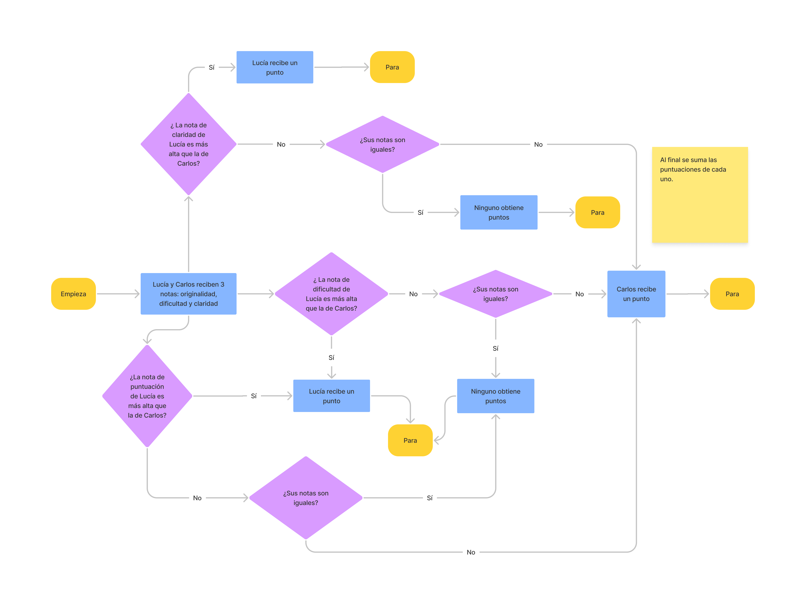
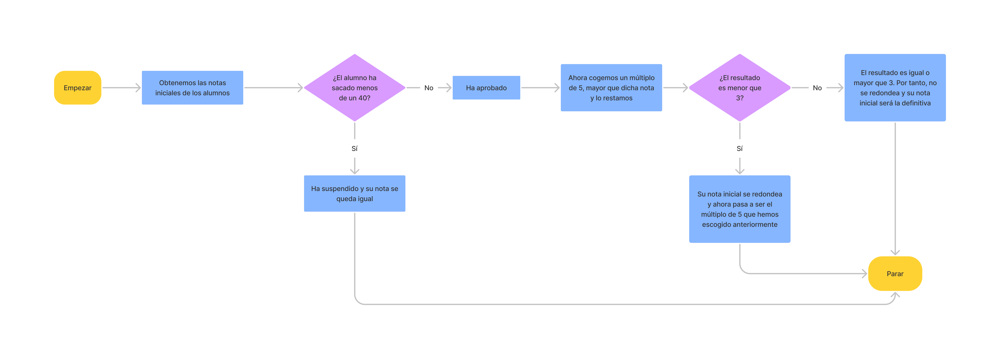
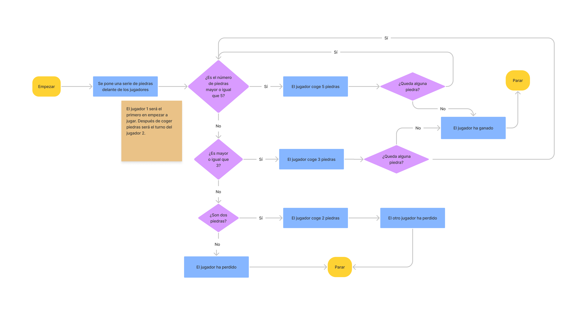
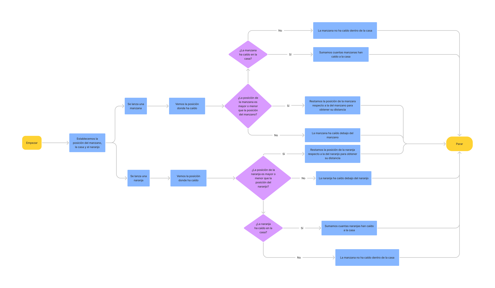

# Tarea-grupal
Nuestra dirección de GitHub para este repositorio es la siquiente: [GitHub](https://github.com/andmansim/Tarea-grupal)
https://github.com/andmansim/Tarea-grupal

En este proyecto grupal hay varias tareas:
1) Compara los problemas: en este ejercicio, comparamos los problemas de dos estudiantes basándonos en tres criterios (claridad, originalidad, dificultad), cuyas puntuaciones se generan aleatoriamente. Por cada criterio que supere un alumno frente al otro, ganará un punto. Si tienen la misma calificacion, no ganan ninun punto.

El diagrama de flujo de este este es el siguiente:




EL codigo de este ejercicio es el siguiente:
```import random
claridadA = random.randint(0, 100)
originalidadA = random.randint(0, 100)
dificultadA = random.randint(0, 100)
claridadB = random.randint(0, 100)
originalidadB = random.randint(0, 100)
dificultadB = random.randint(0, 100)
a = [claridadA, originalidadA, dificultadA]
b = [claridadB, originalidadB, dificultadB]
Lucia = []
Carlos = []

#funcion para sumar las puntuaciones
def suma_puntuacion(lista):
    lista.append(1)


#codigo principal
if a[0] > b[0]:
    suma_puntuacion(Lucia)
    print(str(a[0]) + " es mayor que " + str(b[0]) + ", por lo que Lucia se lleva un punto.")
elif a[0] < b[0]:
    suma_puntuacion(Carlos)
    print(str(a[0]) + " es menor que " + str(b[0]) + ", por lo que Carlos se lleva un punto.")
if a[1] > b[1]:
    suma_puntuacion(Lucia)
    print(str(a[1]) + " es mayor que " + str(b[1]) + ", por lo que Lucia se lleva un punto.")
elif a[1] < b[1]:
    suma_puntuacion(Carlos)
    print(str(a[1]) + " es menor que " + str(b[1]) + ", por lo que Carlos se lleva un punto.")
if a[2] > b[2]:
    suma_puntuacion(Lucia)
    print(str(a[2]) + " es mayor que " + str(b[2]) + ", por lo que Lucia se lleva un punto.")
elif a[2] < b[2]:
    suma_puntuacion(Carlos)
    print(str(a[2]) + " es menor que " + str(b[2]) + ", por lo que Carlos se lleva un punto.")
else:
    Lucia.append(0)
    Carlos.append(0)
    print("Los valores son iguales, por lo que nadie se lleva puntos.")

puntuacion_total_Lucia = sum(Lucia)
puntuacion_total_Carlos = sum(Carlos)
print("La puntuacion total de lucia: " +str(puntuacion_total_Lucia))
print("La puntuacion total de carlos: " +str(puntuacion_total_Carlos))

puntuacion_final = [puntuacion_total_Lucia, puntuacion_total_Carlos]
print(puntuacion_final)
```

2) Estudiantes de calificacion: en este ejercicio, tenemos que redondear o no las calificaciones de unos estudiantes. El redondeo dependerá de ciertos criterios (si es menos de cuarenta no se redondea porque es suspenso; si el multiplo de 5 mas cercano a su nota esta mas lejos que de tres numeros, no se redondea; en otra situacion, si)

El diagrama de flujo de este ejercicio es el siguiente:




El codigo de este ejercicio es el siguiente:
```import random

notas = []
mulriplos_5 = [45, 50, 55, 60, 65, 70, 75, 80, 85, 90, 95, 100]

def calificaciones():
    calificacion = random.randint(0,100)
    notas.append(calificacion)
    
# Para conseguir un múltiplo de 5 mayor que la nota
def redondear(x, base):
    a = base * round(x/base)
    if a < x:
        a = a + 5
    return a


    
y = 0
while y < 5:

    d = calificaciones()
    y = y + 1
print("Notas iniciales")
print(notas)
notas.sort()
print(notas)
suspensos = []
aprobados = []

for i in range (0,5):
    if notas[i] < 40:
        suspensos.append(notas[i])
    else:
        aprobados.append(notas[i])
    
print(suspensos)
print(aprobados)
 
for i in range(len(aprobados)):
    print("Alumno " + str(i) + " ha sacado " + str(redondear(aprobados[i], 5)))

for i in range(len(suspensos)):
    print("Alumno " + str(i) + " ha suspendido con " + str(suspensos[i]))
```

3) Juego de piedras: En este juego, cada jugador tiene n piedras, y el objetivo es quitar las piedras del contrario. En cada turno pueden quitar 1, 3 o 5 piedras. Perderá quien no pueda mover.

El diagrama de flujo de este ejercicio es el siguiente:




El codigo del ejercicio:
```"""
Reglas:
Tenemos n piedras y hay dosjugadores los cuales deberán intentar quitar todas las piedras para poder ganar.
Movimientos:
-quitar tres piedraa
-quitar dos piedras
-quitar cinco piedras
Siempre empezará el jugador uno.
  
"""
import random
piedras = 1
print(piedras)
print ("Empieza jugando el jugardo 1")
def repartir(p):
    if p >= 5:
        jugador = 5
        
    elif p < 5 and p >= 3:
        jugador = 3
        
    elif p == 2: 
        jugador = 2
        
    else:
        jugador = p
    return jugador

while piedras > 0:
    print("Piedras del jugador 1:")
    jugador1 = repartir(piedras) 
    print(jugador1)
    piedras = piedras - jugador1
    if jugador1 < 2:
        print("Jugador 1 pierde")
        break
    elif piedras == 0:
        print("Jugador 2 pierde")
        break
    print("Piedras del jugador 2")
    jugador2 = repartir(piedras)
    piedras = piedras - jugador2
    print(jugador2)
    if jugador2 < 2:
        print("Jugador 2 pierde")
        break
    elif piedras == 0:
        print("Jugador 1 pierde")
        break
```

4) La escalera: El objetivo de este ejercicio es crear una escalera, de manera que el primer escalon es un '#', y en cada escalon se suma uno, hasta m veces (donde m es un numero aleatorio)

El codigo del ejercicio:
```"""
lo que hay que conseguir:
#
##
###
####
#####
... hasta m
"""
import random
m = random.randint(1,10)
for b in range(0,m+1):
    producto ='#' * b
    print(producto)
```

5) Manzana y naranja: El objetivo de este ejercicio es determinar cuantas manzanas y naranjas caen encima de la casa de Sam, donde el manzano y el naranjo estam a una cierta distancia de la casa. La distancia que pueden recorrer las manzanas y las naranjas es aleatoria, y si es negativa, es que han caido por detras de los arboles, es decir, en direccion contraria a la casa.

El diagrama de flujo de este ejercicio es el siguiente:




El codigo es el siguiente:
```
# distancia casa: s y t
# manzano: a
#naranjo: b
import random
s = (7)
t = (11)
b = (15)
a = (5)
distancia_casa = [s,t]
distancia_arboles = [a,b]
manzanas_lista = []
naranjas_lista = []

def lanzamiento_manzana():
    j = random.randint(0,11)
    return j

def lanzamiento_naranja():
    h = random.randint(7,20)
    return h


def manzana (posicion_manzana):
    if posicion_manzana != 5:
        distancia_manzana = posicion_manzana - a
    else:
        distancia_manzana = 0
    return distancia_manzana

def naranja (posicion_naranja):
    if posicion_naranja != 15:
        distancia_naranja = posicion_naranja - b
    else:
        distancia_naranja = 0
    return distancia_naranja

total_manzanas = 0
total_naranjas = 0
contador = 3
while contador != 0:
    posicion_m = lanzamiento_manzana()
    print("Posición de las manzanas")
    print(posicion_m)
    posicion_n = lanzamiento_naranja()
    print("Posición de las naranjas")
    print(posicion_n)
    
    m = manzana(posicion_m)
    manzanas_lista.append(m)
    print("Lista de las manzanas")
    print(manzanas_lista)
    n = naranja(posicion_n)
    naranjas_lista.append(n)
    print("Lista de las naranjas")
    print(naranjas_lista)
    
    
    if 7 <= posicion_m <= 11:
        total_manzanas = total_manzanas + 1
        print("Manzanas en la casa")
        print(total_manzanas)
    

    
    if 7 <= posicion_n <= 11:
        total_naranjas = total_naranjas + 1  
        print("Naranjas en la casa")
        print(total_naranjas)
   
    
    contador = contador - 1


print("Número total de manzanas en la casa")
total_m = total_manzanas
print(total_m)
print("Número total de naranjas en la casa")
total_n = total_naranjas
print(total_n)
```

6) Rana en laberinto: En este ejercicio tenemos que determinar la probrabilidad que tiene la rana Gustavo en salir del laberinto. Los obtaculos que tiene son teletrasnsportes, muros y bombas. Asimismo, hemos impreso el laberinto.

El diagrama de flujo de este ejercicio es el siguiente:


El codigo de este ejercicio es:

```import random
from functools import reduce
import operator

laberinto = [
    ['I', 'X', 'X', 'B', 'X', 'X'],
    [' ', 'X', ' ', ' ', ' ', ' '],
    [' ', 'B', ' ', 'B', 'T2', ' '],
    [' ', ' ', ' ', 'X', ' ', ' '],
    [' ', ' ', ' ', 'X', ' ', ' '],
    ['T2', 'T1', ' ', 'T1', ' ','S']
    ]

#listas con las coordenadas correspondientes, necesarias para imprimir el laberinto
muro = ((0,1), (0,2), (0,4), (0,5), (1,1), (3,3), (4,3))
bomba = ((0,3),(2,1),(2,3))
teletransporte_1 = ((5,1), (5,3))
teletransporte_2 = ((5,0), (2,4)) 
inicio = ((0,0))
salida = ((5,5))

#listas vacias que se usan en distntas funciones
solucion = []
lab =[]

#listas de probabilidades necesarias para calcular la probabilidad en la funcion 'probabilidad'
prob_tres_cuartos = [(3, 1), (1, 4), (2, 4), (3, 4), (4, 4), (3, 2), (4, 2)]
prob_dos_tercios = [(1, 0), (2, 0), (1, 5), (2, 5), (5, 3)]
prob_uno = [(3, 0), (4, 0), (5, 0), (5, 1), (4, 1), (5, 4), (5, 2), (3, 5), (4, 5), (5, 5)]
prob_un_medio = [(0,0), (1, 2), (2, 2), (1, 3)]
prob_muerte = [(2, 1), (0, 3), (2, 3)]

#funcion que crea el laberinto
def creacionlab():
        fila = []
        for i in range(0,6): #line
                for j in range(0,6): #column             
                        if tuple([i,j]) in muro:
                                fila.append("X")
                        elif tuple([i,j]) in bomba:
                                fila.append("B")
                        elif tuple([i,j]) in teletransporte_1:
                                fila.append("T1")
                        elif tuple([i,j]) in teletransporte_2:
                                fila.append("T2")
                        elif tuple([i,j]) in inicio:
                                fila.append("I")
                        elif tuple([i,j]) in salida:
                                fila.append("S")
                        else:
                                fila.append(" ")
                lab.append (fila)
                fila = []


#funcion que calcula aleatoriamente el siguiente movimiento de la rana
def calcular_siguiente(posicion_actual): 
        coordenada = [] 
        x = posicion_actual[0] 
        y = posicion_actual[1]
        
        while coordenada == []:
            a = random.randint(1, 4)
            prob = Probabilidad(x, y)
            if a == 1:
                    if arriba(x, y) == True:
                            coordenada.append(x-1) 
                            coordenada.append(y) 
            elif a == 2:
                    if abajo(x, y) == True: 
                            coordenada.append(x+1) 
                            coordenada.append(y) 
            elif a == 3: 
                    if izquierda(x, y) == True: 
                            coordenada.append(x) 
                            coordenada.append(y-1) 
            elif a == 4:
                    if derecha(x, y) == True: 
                            coordenada.append(x) 
                            coordenada.append(y+1)
            if prob != 0:
                solucion.append(prob) 
                    
        return coordenada, prob

#las proximas 4 funciones indican si es posible o mover en la direccion que indican
def arriba(x, y): 
        if x > 0 and x < 5: 
                if laberinto[x-1][y] != "X": 
                        return True
        return False

def abajo(x, y): 
        if x >= 0 and x < 4: 
                if laberinto[x+1][y] != "X":
                        return True
        return False 

def derecha(x, y): 
        if y >= 0 and y < 4: 
                if laberinto[x][y+1] != "X":
                        return True
        return False 

def izquierda(x, y): 
        if y > 0 and y <= 5: 
                if laberinto[x][y-1] != "X":
                        return True
        return False

#funcion que calcula la probabilidad
def Probabilidad(x,y):
    if estaEnLista(x, y, prob_tres_cuartos) == True:
        prob = 3/4
    elif estaEnLista(x, y, prob_dos_tercios) == True:
        prob = 2/3 
    elif estaEnLista(x, y, prob_uno) == True:
        prob = 1
    elif estaEnLista(x, y, prob_un_medio) == True:
        prob = 1/2
    elif estaEnLista(x, y, prob_muerte) == True:
                prob = 0
                                                
    return prob

#funcion que indica si una pareja de numeros pertenece a una lista o no, necesaria para la funcion probabilidad
def estaEnLista(numA, numB, lista): 
        for x in range(len(lista)): 
                if lista[x][0] == numA and lista[x][1] == numB: 
                        return True 
        return False

#CODIGO PRINCIPAL
#creacionlab()
#for x in lab:
#    print(" ".join(x))
posicion_actual = [0,0]
x = posicion_actual[0]
y = posicion_actual[1]
prob = 10
while laberinto[x][y] != "S" and prob != 0: 
        posicion_siguiente, prob = calcular_siguiente(posicion_actual)
        print("posicion_siguiente " + str(posicion_siguiente))
        print("prob " + str(prob))
        posicion_actual[0] = posicion_siguiente[0] 
        posicion_actual[1] = posicion_siguiente[1] 
        x = posicion_actual[0] 
        y = posicion_actual[1]
        if estaEnLista(x, y, teletransporte_1) == True:
                if posicion_actual[0] == 5 and posicion_actual[1] == 1:
                        posicion_actual[0] = 5
                        posicion_actual[1] = 3
                if posicion_actual[0] == 5 and posicion_actual[1] == 3:
                        posicion_actual[0] = 5
                        posicion_actual[1] = 1

        elif estaEnLista(x, y, teletransporte_2) == True:
                if posicion_actual[0] == 5 and posicion_actual[1] == 0:
                        posicion_actual[0] = 2
                        posicion_actual[1] = 4
                if posicion_actual[0] == 2 and posicion_actual[1] == 4:
                        posicion_actual[0] = 5
                        posicion_actual[1] = 0
    

leche = reduce(operator.mul,solucion)
print (str(leche))
```

7) Suma simple de una matriz: Dada una matriz de elementos aleatorios, en este ejercicio tenemos que devolver la suma de todos los elementos de esta matriz

EL codigo es el siguiente:
```import random
  
matriz =[]

def creacionmatriz(n,m):
        fila = []
        h = 0
        for i in range(n,m): #linea
            for j in range(n,m): #columna
                
                a = random.randint(0,100)
                fila.append(a)
                h = h + a 
            matriz.append (fila)
            fila = []
            
        return(h)
suma = creacionmatriz(0,3)  # Dimensiones de la matriz y donde nos añade el valor final

# Para unir las listas que forma a la principal

for x in matriz:
    print(" ".join(str(x)))

print(suma)
```
